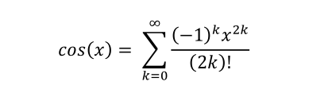

# Parallel-Programmin-using-MPI
Calculate the value of cos(x) by taylor expansion method using parallel programming techniques using MPI 

## Steps to run the codes
Program should run on UBUNTU OS  
1- Start UBUNTU  
2- install mpich package on ubuntu  
   run this command  `sudo apt-get install -y mpich`  
3- Compile the two .cpp files  
   `mpic++ -o sequence sequence.cpp`  
   `mpic++ -o parallel parallel.cpp`  
4- Run The output files (N -> number of processes)  
   `mpirun -np (N) ./sequence`  
   `mpirun -np (N) ./parallel`  
5- Enter the value of x(in radian) and i  
6- Get the results  

## Results and Observation
Results show that the Sequence code is faster than the parallel code in small i  
And this happened due to the overhead of the communication between the processes 
 
And this overhead increases if we increase parallelism (the number of processes) 
 
The problem is simple and done very quickly so that the parallelism of this code makes overheads as the communication between processes and sending the data between them takes long time compared to the operation it should do. 

The Parallelism has advantage in case of complex problems that take long time in sequence programming so the overhead of communication of the processes is very tiny compared to the operation that every process do. 

The speedup hits the hardware boundary at processes more than 4 because the computer which runs the code has only 4 cores in its processor. 

So if we want to speed up more we must add more cores.
